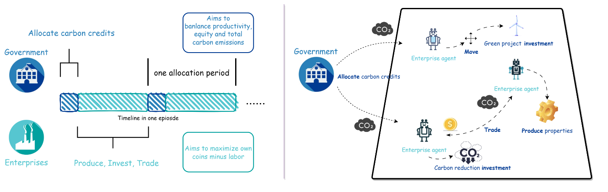
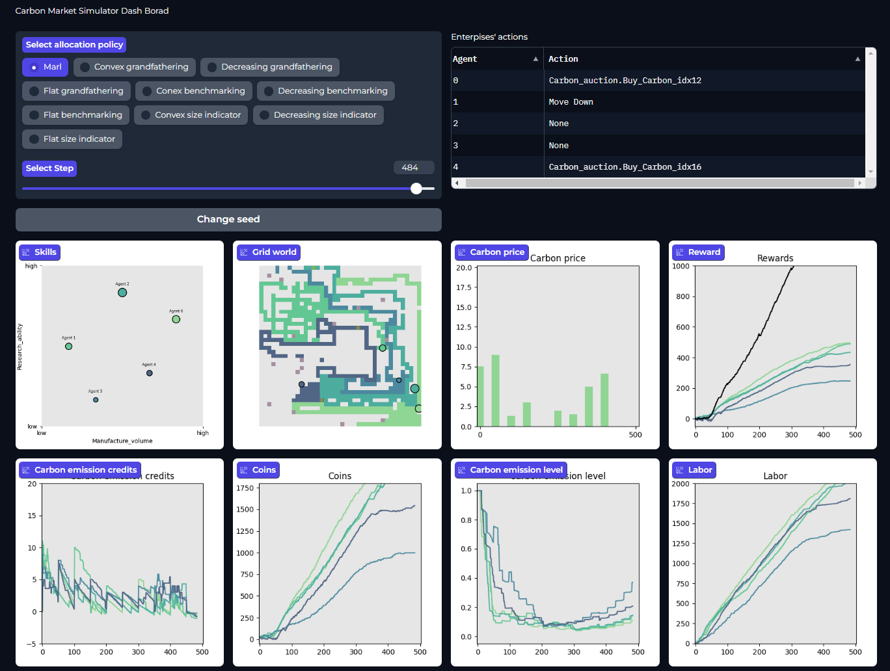

# Carbon Market Simulation with Adaptive Economic Design



Our demo video is available at [Google drive](https://drive.google.com/file/d/1pBG51rN_bRdOB7Cv-qawPRo7pOw6aNSO/view?usp=sharing)

-How to train

To start training low-level Enterprise agents with defuat configuration:
```
python3 rllib/training_script.py --run_dir rllib/exp/defuat
```

After loading pre-trained Enterprise agents' parameters, we can start training high-level Government agents:
```
python3 rllib/training_script.py --run_dir rllib/exp/pl1
```

-Our experiment results


-Visualisation
We also implement visualisation of our simulator, with saved logs in test episodes, please follow the [guide](vis/Dashboard.ipynb).



